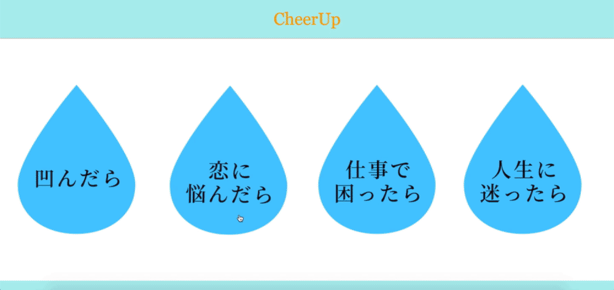

## README

# CheerUp
登録されている過去～現代の有名人やキャラクターの名言を閲覧できる。
 
 
 

## 制作背景
著名人や偉人の名言を見るのが元々好きだったが、 
多数の名言まとめサイト、SNSアカウント、書籍があることを知り、 
一般的にも需要があることを知った。 
そこで複数の著名人を一覧にして名言を見れるサービスがあれば面白いと考えた。

## 工夫したところ
・ユーザーの悩みの種類に応じた切り分け 
・YouTube動画の埋込み

## 今後実装したい機能
・各データのデータベース登録 
・簡易投稿機能（画像のトリミング等も自動化）
